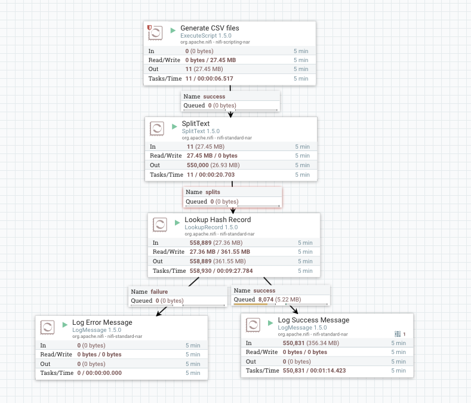
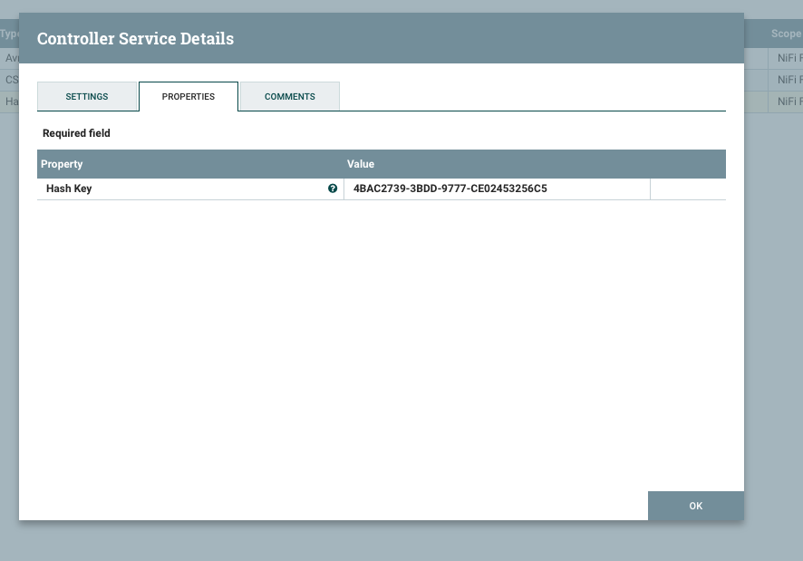

# nifi-hash-services-bundle

Apache NiFi Lookup Services for data hashing.

## Compiling

```sh
> git clone https://github.com/mrcsparker/nifi-hash-services-bundle.git
> cd nifi-hash-services-bundle
> mvn clean && mvn package
> cp ./nifi-hash-services-nar/target/nifi-hash-services-nar-1.5.0.nar /PATH/TO/NIFI/lib
> cp ./nifi-hash-services-api-nar/target/nifi-hash-services-api-nar-1.5.0.nar /PATH/TO/NIFI/lib
```

## Running

```sh
> cd /PATH/TO/NIFI/
> ./bin/nifi.sh run
```

## Testing

```sh
> cd nifi-hash-services-bundle
> mvn clean && mvn test
```

## Sample dataflow

See the [./examples](./examples) directory.

### Dataflow



### Configuration



